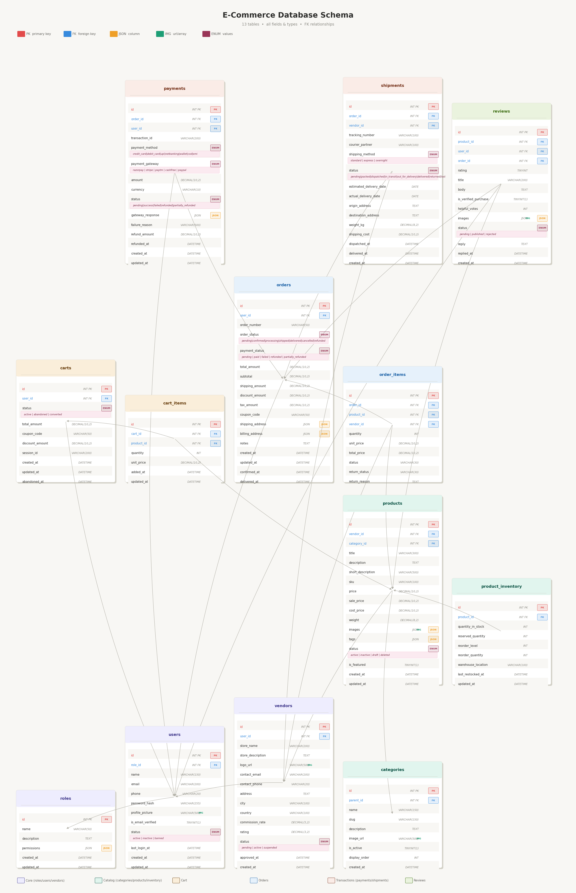

# 🛒 Industry-Level SQL Practice — E-Commerce Database

A comprehensive, production-grade SQL practice project built on a realistic **multi-vendor e-commerce database** (MySQL 8+). It covers **200 SQL questions** across 6 difficulty levels — from basic SELECT queries to advanced window functions, CTEs, fraud detection, and platform health dashboards.

---

## 📁 Project Structure

| File | Description |
|------|-------------|
| `0. SetUp.sql` | Full database schema + stored procedure to seed ~50,000+ rows of realistic data |
| `1. ecommerce_sql_practice.sql` | Level 1 — Basic Queries (Q1–Q30) |
| `2. ecommerce_sql_practice2.sql` | Level 2 — Filtering & Aggregation (Q31–Q70) |
| `3. ecommerce_sql_practice3.sql` | Level 3 — Joins (Q71–Q110) + Level 4 — Business Analytics (Q111–Q140) |
| `4. ecommerce_sql_practice4.sql` | Level 5 — Advanced SQL (Q141–Q170) + Level 6 — Hard Production Queries (Q171–Q200) |
| `Answer200Q.sql` | ✅ Complete answers for all 200 questions |
| `ecommerce_schema.png` | Entity-Relationship Diagram of the database |

---

## 🗄️ Database Schema

The `ECOMMERCE` database contains **13 tables** modelling a real-world multi-vendor marketplace:

```
roles ──< users ──< vendors ──< products ──< product_inventory
                  │                       └──< order_items >──< orders ──< payments
                  │                                                     └──< shipments
                  └──< carts ──< cart_items                             └──< reviews
categories (self-referencing parent/child hierarchy)
```

### Tables Overview

| Table | Rows (approx.) | Purpose |
|-------|---------------|---------|
| `roles` | 3 | admin, vendor, customer |
| `users` | 2,205 | All platform users |
| `vendors` | 200 | Seller/merchant accounts |
| `categories` | 27 | Hierarchical product categories |
| `products` | 2,200 | Product catalog |
| `product_inventory` | 2,200 | Stock levels & warehouse info |
| `carts` | 1,800 | Shopping carts |
| `cart_items` | ~2,700 | Items inside carts |
| `orders` | 3,200 | Customer orders |
| `order_items` | ~7,000 | Line items per order |
| `payments` | ~2,800 | Payment transactions |
| `shipments` | ~2,500 | Shipment & tracking records |
| `reviews` | ~800 | Product reviews |

### Key Design Highlights
- **JSON columns** — `permissions`, `images`, `tags`, `shipping_address`, `gateway_response`
- **ENUM columns** — order status, payment method, shipment status, user status
- **Self-referencing FK** — `categories.parent_id` for category hierarchy
- **Composite UNIQUE keys** — e.g., one review per user per product per order
- **Indexes** on all foreign keys and frequently filtered columns

---

## 🚀 Getting Started

### Prerequisites
- MySQL 8.0+ (window functions, JSON, recursive CTEs required)
- Any SQL client: MySQL Workbench, DBeaver, TablePlus, or CLI

### Setup

```sql
-- Step 1: Run the setup file to create schema and seed data
SOURCE '0. SetUp.sql';

-- Step 2: Verify data was loaded
SELECT 'orders' AS tbl, COUNT(*) FROM orders
UNION ALL SELECT 'products', COUNT(*) FROM products
UNION ALL SELECT 'users', COUNT(*) FROM users;
```

> ⚠️ The seed procedure generates ~50,000+ rows and may take 1–3 minutes to complete.

---

## 📚 Question Levels

### Level 1 — Basic Queries (Q1–Q30)
Fundamental SELECT, WHERE, ORDER BY, LIMIT, IS NULL, BETWEEN.

**Sample topics:**
- Users registered in the last 30 days
- Products with price > ₹10,000
- Orders by status, coupon usage, featured products
- Shipments by courier, payments by method

---

### Level 2 — Filtering & Aggregation (Q31–Q70)
GROUP BY, HAVING, COUNT, SUM, AVG, ROUND, DATE_FORMAT, conditional aggregation.

**Sample topics:**
- Total revenue from paid orders
- Top 5 categories by active product count
- Cart abandonment rate
- Payment success rate per method
- Cross-tab matrix of order status × payment status

---

### Level 3 — Joins (Q71–Q110)
INNER JOIN, LEFT JOIN, multi-table joins, EXISTS, NOT EXISTS, self-joins.

**Sample topics:**
- Full order lifecycle: order → payment → shipment
- Products in active carts but never ordered
- Customers who ordered but never reviewed
- Orders containing products from multiple vendors
- Inventory status: in-stock / low-stock / out-of-stock

---

### Level 4 — Business Analytics (Q111–Q140)
Window functions (LAG, LEAD, ROW_NUMBER), CTEs, business KPIs.

**Sample topics:**
- Month-over-month revenue growth
- Vendor performance report (revenue, rating, return rate, fulfillment speed)
- Customer lifetime value (CLV)
- Monthly cohort conversion rate
- RFM segmentation (Recency, Frequency, Monetary)
- Seasonal revenue trends (Q1 vs Q2 vs Q3 vs Q4)

---

### Level 5 — Advanced SQL (Q141–Q170)
Window functions (RANK, DENSE_RANK, NTILE, PERCENT_RANK, CUME_DIST, FIRST_VALUE), recursive CTEs, correlated subqueries, pivots.

**Sample topics:**
- Recursive category hierarchy traversal
- 7-day rolling average revenue per vendor
- Product revenue pivot by month (Jan–Dec)
- Orders placed within 5 minutes by the same user (self-join)
- Full conversion funnel: carts → orders → paid → shipped
- Monthly churn detection

---

### Level 6 — Hard Production Queries (Q171–Q200)
Real-world production-grade queries used in data engineering and analytics roles.

**Sample topics:**
- Full cohort retention table (M0–M6 retention %)
- Payment fraud detection (multiple methods on same order within 1 hour)
- Order total reconciliation (total ≠ subtotal + shipping − discount + tax)
- Real-time inventory dashboard with days-to-stockout
- Vendor payout report (gross sales, commission, net payout)
- Flash sale abuse detection
- Product co-purchase analysis (market basket)
- Multi-CTE vendor health score
- Dynamic pricing signals (top 10% demand + low stock)
- Platform health-check dashboard (GMV, AOV, refund rate, abandonment rate, new vs returning)

---

## 💡 Key SQL Concepts Covered

| Concept | Questions |
|---------|-----------|
| Basic SELECT / WHERE / ORDER BY | Q1–Q30 |
| Aggregate functions (COUNT, SUM, AVG) | Q31–Q70 |
| GROUP BY / HAVING | Q31–Q70 |
| INNER JOIN / LEFT JOIN | Q71–Q110 |
| EXISTS / NOT EXISTS | Q96, Q103, Q152, Q163 |
| Subqueries (correlated & derived) | Q107, Q147, Q155, Q168, Q169 |
| CTEs (WITH clause) | Q143–Q200 |
| Recursive CTEs | Q146 |
| Window Functions (ROW_NUMBER, RANK, DENSE_RANK) | Q113, Q141, Q142, Q148 |
| LAG / LEAD | Q111, Q143, Q144 |
| NTILE / PERCENT_RANK / CUME_DIST | Q151, Q156, Q166 |
| FIRST_VALUE / running totals | Q153, Q154 |
| Conditional aggregation (CASE WHEN in SUM) | Q68, Q134, Q149, Q159 |
| Pivot queries | Q149, Q159 |
| JSON functions (JSON_EXTRACT) | Q192 |
| Self-joins | Q160, Q165, Q172, Q191 |
| Date functions (DATEDIFF, TIMESTAMPDIFF, DATE_FORMAT) | Throughout |

---

## 🏗️ Schema Diagram



---

## 🎯 Who Is This For?

- **SQL learners** moving from basics to production-level queries
- **Data analysts / engineers** preparing for technical interviews
- **Backend developers** wanting to understand complex reporting queries
- **Anyone** building or working with e-commerce data systems

---

## 📝 Notes

- All queries are written for **MySQL 8.0+**
- Window functions require MySQL 8+; recursive CTEs require MySQL 8+
- The seed data uses `RAND()` so exact row counts may vary slightly
- `Answer200Q.sql` contains clean, well-commented solutions for all 200 questions
